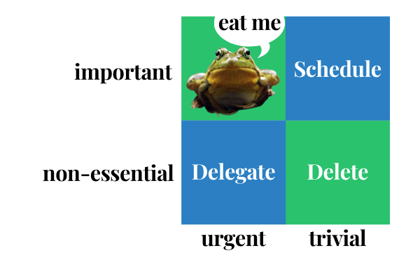

So the story goes, Mark Twain once said:

> Eat a live frog first thing in the morning and nothing worse will happen to you the rest of the day.

Your "frog" is the task that is your most pressing and vital job, and the one that you are most likely procrastinating about.

## But What if You Have 2 Frogs?

Eat the ugliest frog first of course! If you have two important tasks before you, start with the biggest, hardest, and most important task first.

A great way of prioritising tasks is using Eisenhower's Matrix.

The 34th President of the United States, Eisenhower served two terms from 1953 to 1961. He launched DARPA, the fore-runner of the internet, NASA, at the start of the space race, and the peaceful use of alternative energy sources in the Atomic Energy Act. The man got stuff done.

Eisenhower's time management, task management, and productivity methods have been studied and his strategy for taking action and organizing tasks is simple.

Split your to-do list into these 4 categories:
* Urgent and important
* Important, but not urgent
* Urgent, but not important
* Neither urgent nor important

Your ugliest frogs are at the top of the list. They are the important tasks - things that contribute to your long-term mission, values, and goals.

Do the urgent important things as a priority, but make sure you schedule in the non-urgent things. You're the boss of your own life, and the important work to do - improving your skills, deepening your network, executing a creative vision - is rarely urgent.

> What is important is seldom urgent and what is urgent is seldom important.
-Dwight Eisenhower

Discipline yourself to begin immediately and then don't stop until the task is complete before you go on to something else. Multi-tasking is a myth. Eat one frog at a time - you wouldn't want to try and shove multiple frogs in your mouth at once, would you?

The third category is those urgent, but not so important things. Can you delegate these to someone else?

Delete the items that fall into the fourth category - let's face it, if your task is neither urgent or important, is it ever going to get done? Now, doesn't it feel better with fewer items on your to-do list?

## Routine Frogs for Breakfast

Develop the habit of tackling your major task first thing each morning. Eating your frog before you do anything else (that includes checking your emails) and without taking too much time to think about it will **significantly improve your performance and productivity**.

## Failure to Execute

Many people confuse activity with success. These are the people in meeting after meeting, and always *so busy*, but these people can suffer from **failure to execute**. They can get caught up in doing the urgent, but non-important tasks, which ultimately don't lead to goal completion or moving forward.

Effective people launch directly into their major tasks and have discipline to work steadily and single-mindedly until the job is done.

## Check me now

I find it hugely satisfying checking items off of my to-do list. It gets quite addictive - the endorphins released each time give me confidence and energises me.

I use Trello to organise my tasks. I have a board for each project with a "to-do" list, a "doing" list, and a "done" list. It's great to see that done list grow!

Check out Trello, [use my recommendation link](https://trello.com/justan0therdave/recommend) - it's a great tool for collaboration. They also have [a super blog-post on the Eisenhower Matrix](https://blog.trello.com/eisenhower-matrix-productivity-tool-trello-board) - check it out!

